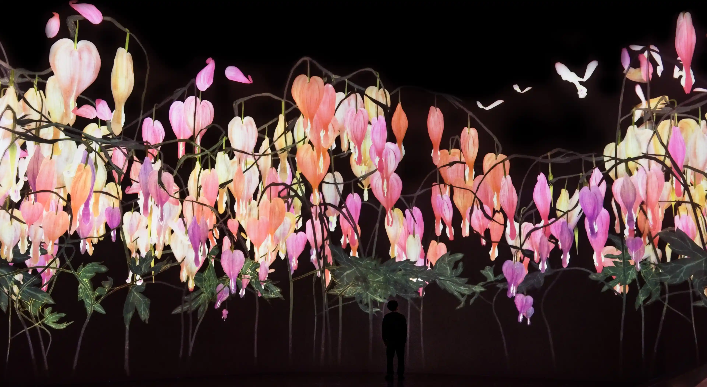

# dhou5621_9103_tut7

## Quiz 8

### Part 1: Imaging Technique Inspiration

I am inspired by teamLab’s _Proliferating Immense Life – A Whole Year per Year_ (2018/2020), an interactive digital installation that visualises the ephemeral beauty of blooming flowers. The dynamic animation of flowers growing and blooming conveys a sense of vitality and transformation, bringing "life" to code. Incorporating this blooming animation into my project would enhance its visual appeal and align with the assignment’s emphasis on dynamic and expressive visual elements.

**Artwork Reference:**
- _teamLab: Proliferating Immense Life – A Whole Year per Year_
- Interactive Digital Installation
- [teamLab Official Site](https://www.teamlab.art/w/proliferating_immense_life/)

#### Reference Images

  

---

### Part 2: Coding Technique Exploration

To replicate the blooming flower animation inspired by teamLab’s *Proliferating Immense Life*, I explored generative flower projects using p5.js. One effective example is [**Bloom** by matthewterhune](https://github.com/matthewterhune/Bloom), which uses shape growth and animation to simulate blooming. The code employs p5.js functions to generate flower shapes that evolve over time, simulating a natural blooming process. This approach aligns with the assignment’s emphasis on dynamic visual elements and can be adapted to incorporate interactive features.

Additionally, the [**Imagine-a-Flower**](https://github.com/wiiilla/Imagine-a-Flower) project by wiiilla offers an interactive flower generator using L-systems and rose curves to create intricate flower patterns that evolve over time. This technique enhances the visual complexity of the blooming animation and offers a deeper understanding of algorithmic design.

These techniques offer expressive, dynamic representations of blooming and can be adapted for creative visual interaction in my project.

#### Coding Technique 1: Bloom by matthewterhune
- GitHub Repository: [matthewterhune/Bloom](https://github.com/matthewterhune/Bloom)
- Live Demo: [terhune.xyz/bloom](http://terhune.xyz/bloom)

#### Coding Technique 2: Imagine-a-Flower by wiiilla
- GitHub Repository: [wiiilla/Imagine-a-Flower](https://github.com/wiiilla/Imagine-a-Flower)

---

_Commit label: **"Quiz 9"**_
